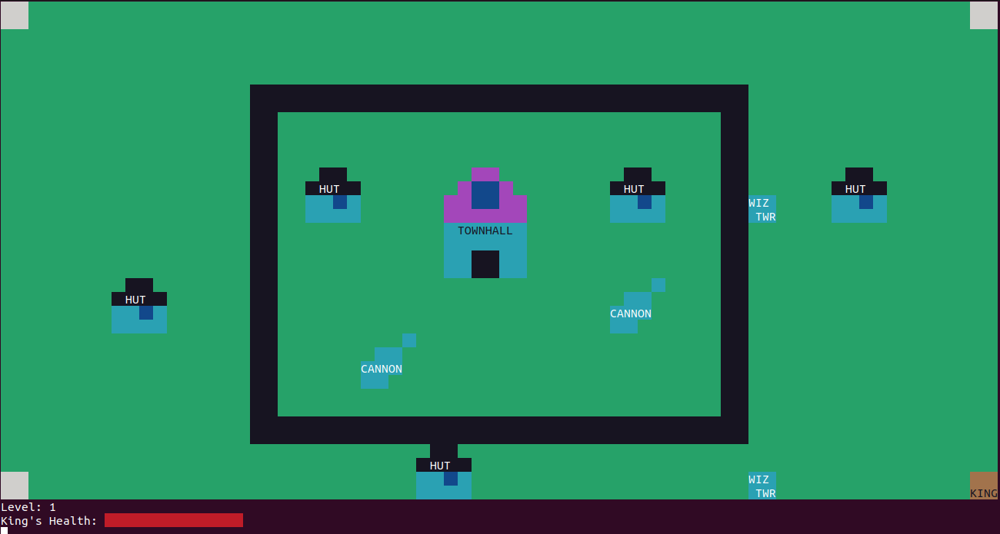

# Clash of Clans

###  A Terminal Based Minified Version of the Game Clash Of Clans

 

## Features

 

- To run the game : `python3 game.py` 
- To quit : <kbd>q</kbd>
- To view replays : `python3 replay.py`  and select the replay you want to watch according to mentioned date and time.
- For Victory : All buildings apart from walls get destroyed from the map in all three levels.
- For Defeat : If all troops and King die before destroying all buildings apart from walls.

 

## Controls :

 

### Hero :

- <kbd>w</kbd> : move up
- <kbd>a</kbd> : move left
- <kbd>d</kbd> : move right
- <kbd>s</kbd> : move down
- <kbd>1</kbd> : Special Attack
- <kbd>space</kbd> : Normal Attack

### Barbarian :

- <kbd>z</kbd> : spawn at point 1
- <kbd>x</kbd> : spawn at point 2
- <kbd>c</kbd> : spawn at point 3

### Dragon :

- <kbd>v</kbd> : spawn at point 1
- <kbd>b</kbd> : spawn at point 2
- <kbd>n</kbd> : spawn at point 3

### Archer :

- <kbd>i</kbd> : spawn at point 1
- <kbd>o</kbd> : spawn at point 2
- <kbd>p</kbd> : spawn at point 3

### Balloon :

- <kbd>j</kbd> : spawn at point 1
- <kbd>k</kbd> : spawn at point 2
- <kbd>l</kbd> : spawn at point 3

 

## New Troops Added : 

 

### StealthArcher :

- <kbd>t</kbd> : spawn at point 1
- <kbd>y</kbd> : spawn at point 2
- <kbd>u</kbd> : spawn at point 3
- Stealth Archer class added using inheritance from Archer class
- Attribute 'spawn_time' is added to denote the spawning time of the stealth archer
- Stealth archer when invisible are in white color and after 10 sec they have the same color as archer
- Everything implemented as mentioned in assignment

### Healer :

- <kbd>e</kbd> : spawn at point 1
- <kbd>f</kbd> : spawn at point 2
- <kbd>g</kbd> : spawn at point 3
- Healers class added with required functionality
- Healers find the closest wounded troop or King
- If all troops are unwounded, it does not heal any troop and stays at its location until a troop gets wounded
- Euclidean distance is used for checking if the closest wounded troop is in range or not
- Euclidean distance is used for checking what all are troops are there in heal radius
- Everything implemented as mentioned in assignment

 

## Assumptions :

 

- Rage and Heal Spell can be applied multiple times.
- The limit for troops in each level is as follows :
    - Barbarians : 10
    - Archers : 7
    - Balloon : 5
    - Dragon : 3
- You have to choose the type of troop movement at start of the game.
- You have to choose the hero after each level.
- Attribute 'building_level' is added in Village class, which denotes the level of Canon, Wizard Tower and Walls
- Walls with level>=3 explode upon being destroyed

 

## Unit Testing

 

- Unit tests prepared to check correctness of some part of the code.
- To run - <code>python3 test.py</code> in the src folder, output stored in <code>output.txt</code>

 

### Cases checked :

 

- King shouldn't move when it is dead
- King should face in the appropriate direction
- King should move at a spawn point
- King should move at a blank
- King shouldn't move over townhall
- King shouldn't move over wall
- King shouldn't move over hut
- King shouldn't move over cannon
- King shouldn't move over wizard tower
- King should move in the appropriate direction
- King should't move out of the village map
- King with a higher speed should move appropriately in the corresponding direction
- King with a higher speed shouldn't move over a building
- HERO_POS should be updated after King's movement
- Other attributes of king shouldn't change